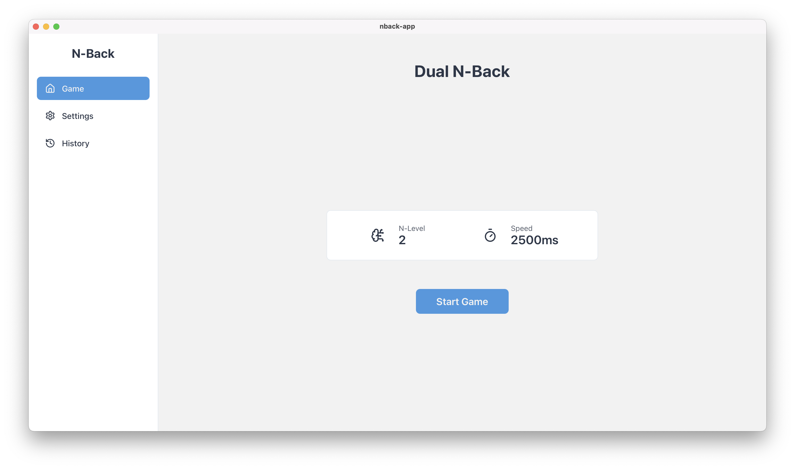
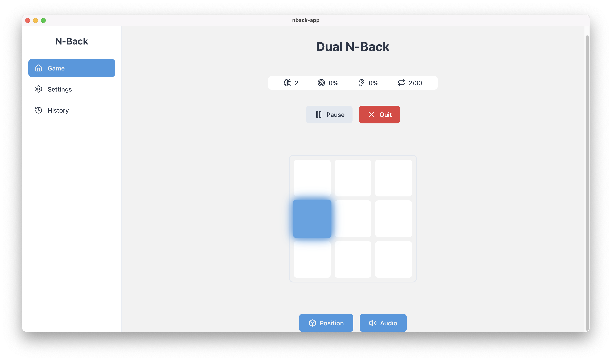
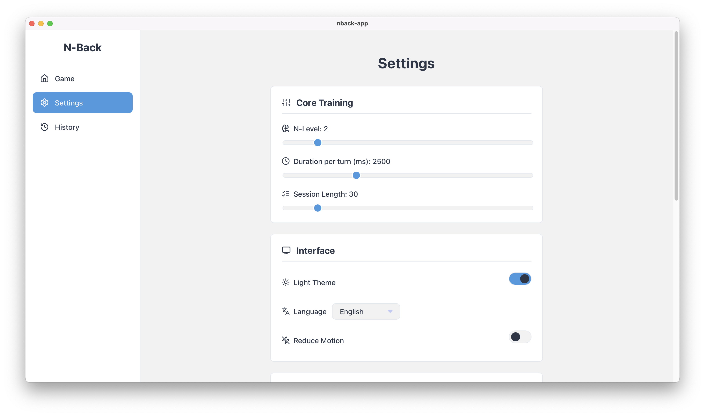
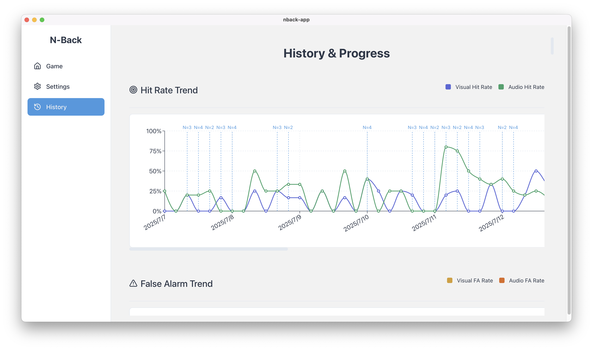
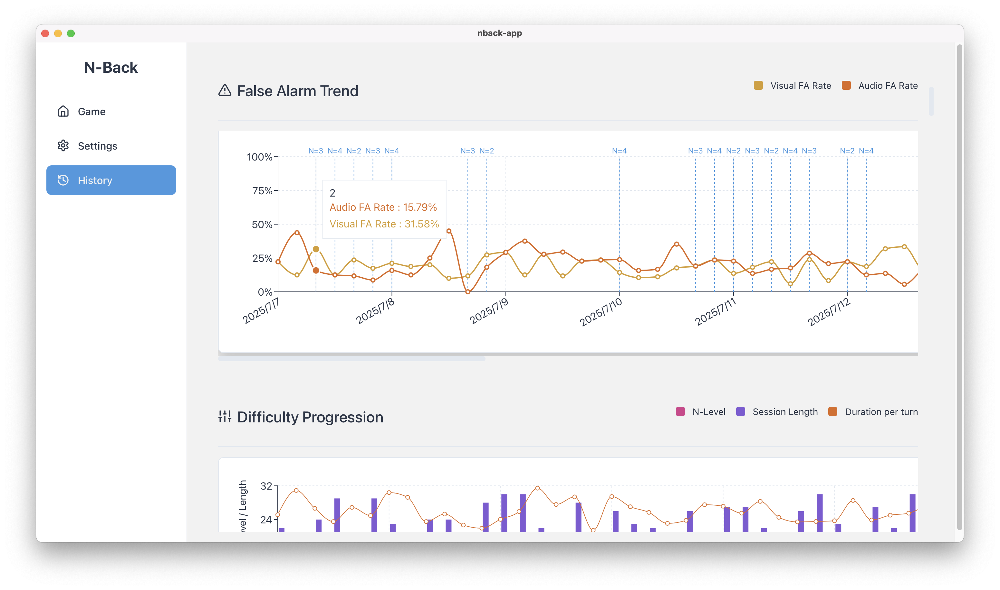
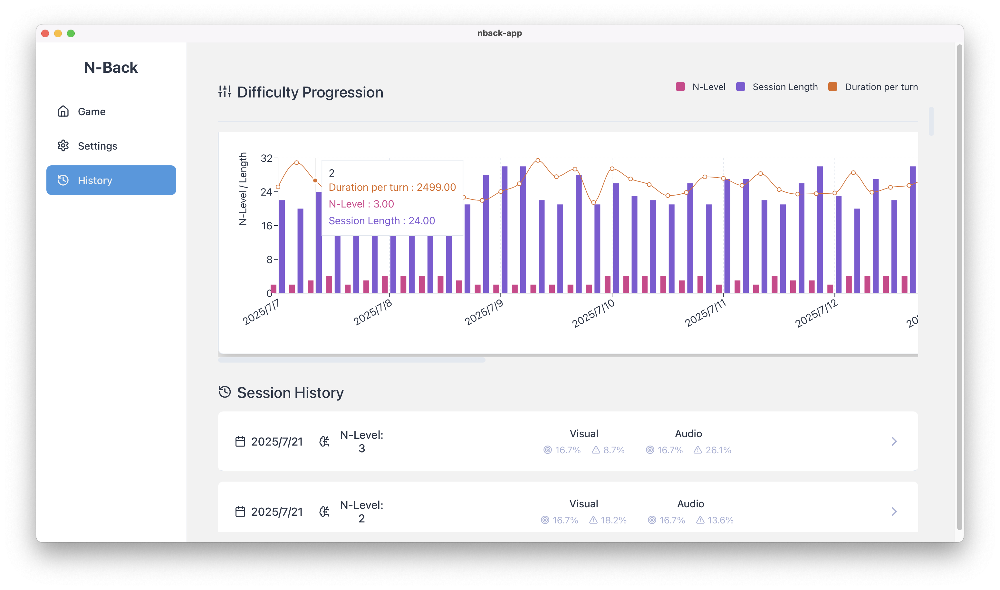
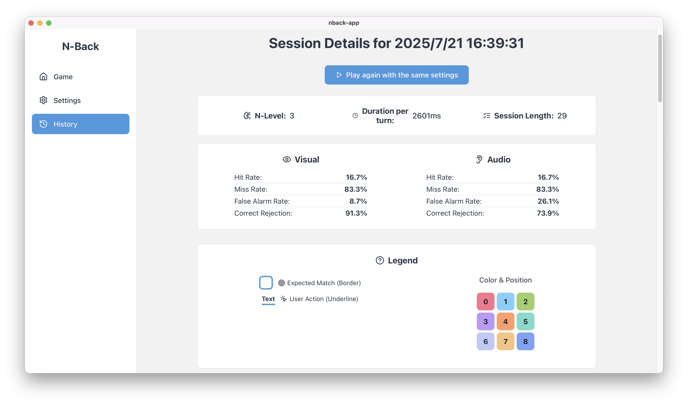
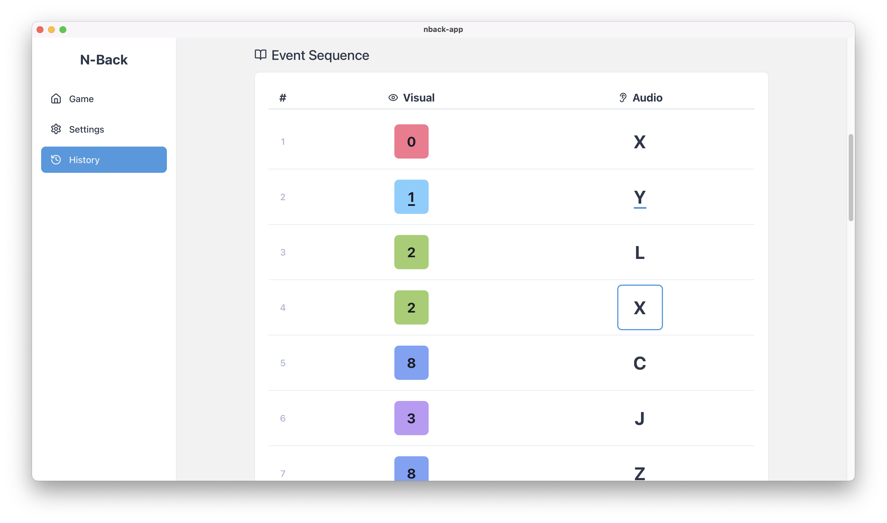

# Dual N-Back: 高级认知训练应用


**Dual N-Back** 是一款精心设计的桌面应用，旨在通过科学验证的 Dual N-Back 任务，系统性地提升用户的核心认知能力，包括工作记忆、注意力和流体智力。本应用融合了现代化的用户界面、高度可定制的训练参数以及详尽的性能分析，为您提供专业级的认知训练体验。

## ✨ 核心优势

- **🚀 科学的训练方法**: 基于经典的 Dual N-Back 任务，这是一种被广泛研究并证实能有效提升工作记忆和流体智力的训练范式。
- **🎨 沉浸式用户体验**: 采用现代化、直观的 UI 设计，结合流畅的动画效果与声音反馈，为您打造一个无干扰的训练环境。
- **⚙️ 精细化参数调校**: 提供高度灵活的设置选项，允许您自由调整 N-Back 等级、试验次数、刺激呈现速度、反馈延迟等多种核心参数，以满足不同阶段的训练需求。
- **📊 全方位表现追踪**: 自动记录每一次训练的详细数据，包括命中率、虚警率、等关键性能指标，助您精确掌握进步轨迹。
- **📈 深度数据洞察**: 通过直观的图表，将您的长期表现数据可视化，清晰展示您在不同难度下的认知能力变化趋势。
- **🌐 多语言支持**: 内置中英双语，无缝切换，满足不同用户的语言偏好。
- **💻 跨平台兼容**: 基于 Tauri 框架构建，确保在 Windows, macOS, 和 Linux 上都能获得原生应用般的流畅体验。


## 🚀 快速开始

请遵循以下步骤在您的本地环境中安装并运行此项目：

1.  **克隆代码库**
    ```bash
    git clone https://github.com/aac6fef/dual-n-back.git
    cd dual-n-back
    ```

2.  **安装依赖项**
    > **注意**: 需要 Node.js 和 Rust 开发环境。
    ```bash
    npm install
    ```

3.  **启动开发模式**
    ```bash
    npm run tauri dev
    ```

4.  **构建应用程序**
    ```bash
    npm run tauri build
    ```

## 📸 应用预览

| 游戏主页 | 游戏进行中 |
| :---: | :---: |
|  |  |

| 设置页面 | 历史记录 |
| :---: | :---: |
|  |  |

| 趋势分析 | 难度曲线 |
| :---: | :---: |
|  |  |

| 详细历史记录 | 事件序列 |
| :---: | :---: |
|  |  |

## 🤝 参与贡献

我们欢迎各种形式的贡献！如果您有任何建议、发现 Bug 或希望添加新功能，请随时提交 [Issues](https://github.com/aac6fef/dual-n-back/issues) 或 [Pull Requests](https://github.com/aac6fef/dual-n-back/pulls)。

## 📄 许可证

本项目采用 [MIT](LICENSE) 许可证。
